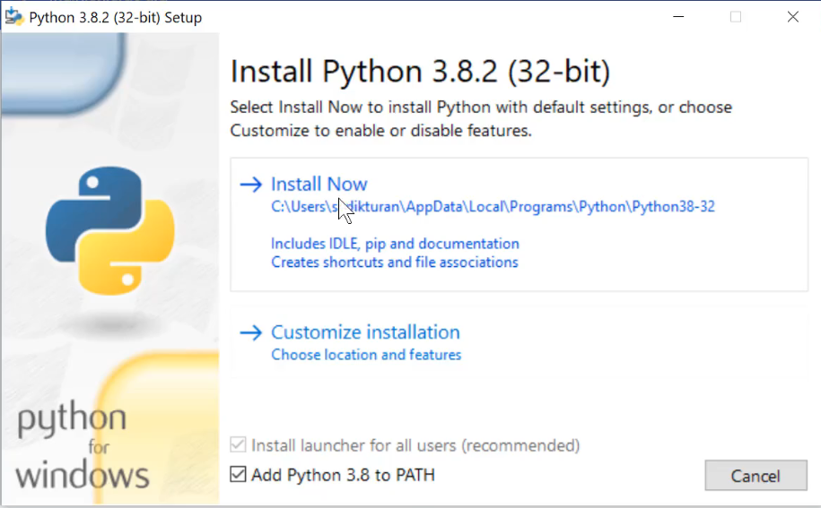
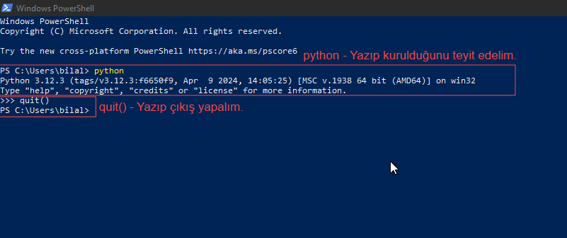
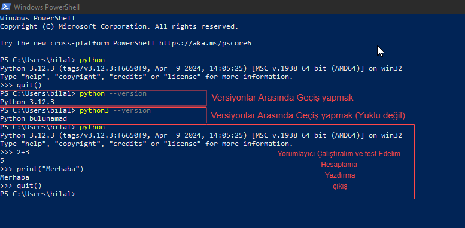
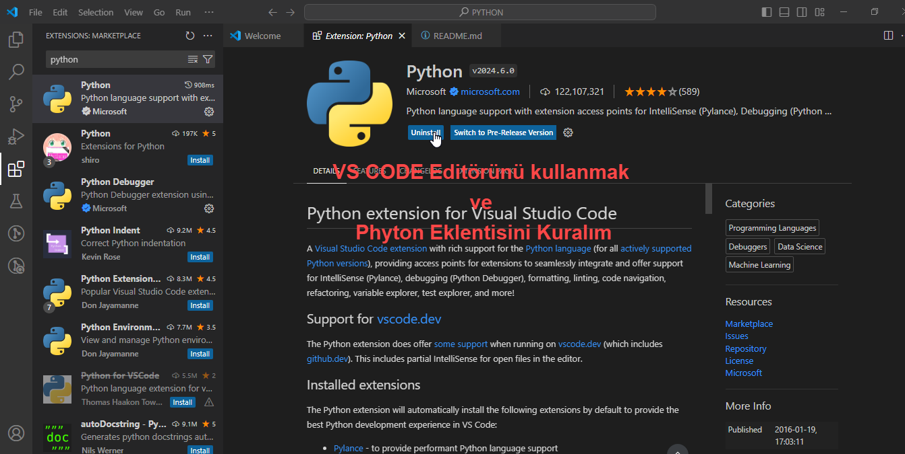
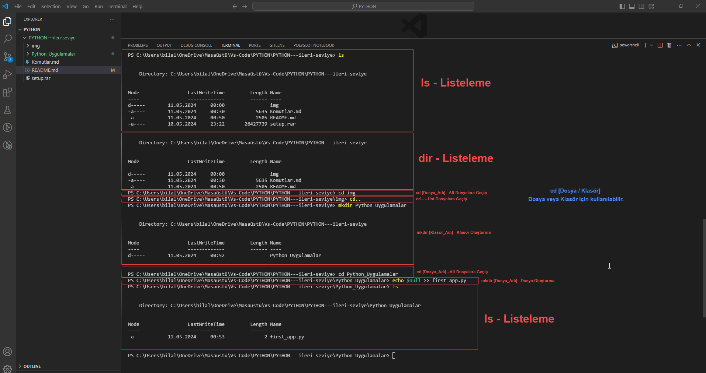

# PYTHON---ileri-seviye
PYTHON / İLERİ SEVİYE


## 1 - İLK KURULUM


## 2 - POWER SHELL - Kurulumu test Etme


## 3 - POWER SHELL - Versiyonlar arasında Geçiş ve Yorumlayıcı Test Etme


## 4 - VS CODE - Editör Seçme ve Eklentiyi Kurmak


## 5 - VS CODE - Terminalde Çalışmak.


**Python ile terminal komutları kullanırken sıkça karşılaşılan bazı komutlar:**
```python
ls      #İlgili Klasör içindeki tüm dosyaları listeler.
dir      #İlgili Klasör içindeki tüm dosyaları listeler.
cd [Dosya Adı]       #ilgili dizindeki dosyaya geçiş yapar.
cd..        #Bir üst Klasöre geçiş yapar.
cls         #Ekranı Temizler (Sadece Windows için).
clear       #Ekranı Temizler.
mkdir [Dosya Adı]       #Klasör Oluşturmak için.


echo $null >> first_app.py      #Python dosyası Ouşturmak için


python      # Python yorumlayıcısını başlatır.
pip      # Python paketlerini yönetir (kurma, kaldırma, güncelleme vb.).
python dosya_adı.py      # Python betik dosyasını çalıştırır.
virtualenv      # Sanal Python ortamları oluşturur.
activate (Windows) / source activate (Unix)      # Sanal ortamı etkinleştirir.
deactivate      # Sanal ortamı devre dışı bırakır.
pip freeze      # Kurulu Python paketlerini ve sürümlerini listeler.
pip install paket_adı      # Belirli bir Python paketini kurar.
pip uninstall paket_adı      # Belirli bir Python paketini kaldırır.
pip show paket_adı      # Belirli bir Python paketinin bilgilerini gösterir.
pip search anahtar_kelime      # Anahtar kelimeye göre Python paketlerini arar.
pip list      # Kurulu Python paketlerini listeler.
python -m venv myenv      # Yeni bir sanal ortam oluşturur (Python 3.3+).
python -V (veya --version)      # Yüklü Python sürümünü görüntüler.
python -m pip install --upgrade pip      # Pip'in en son sürümünü yükseltir.
python -m http.server [port]      # Basit bir HTTP sunucusu başlatır.
python -c "print('Hello, world!')"      # Bir Python ifadesini doğrudan terminalden çalıştırır.
exit() veya Ctrl+D      # Python yorumlayıcısını kapatır.

```

**Bu komutlar, Python geliştirme sürecinde sıkça kullanılır ve paket yönetimi, sanal ortamlar, betik dosyalarının çalıştırılması gibi çeşitli görevleri gerçekleştirmek için kullanılır.**

- Diğer Komutlar İçin [Tıklayın.](Komutlar.md)
