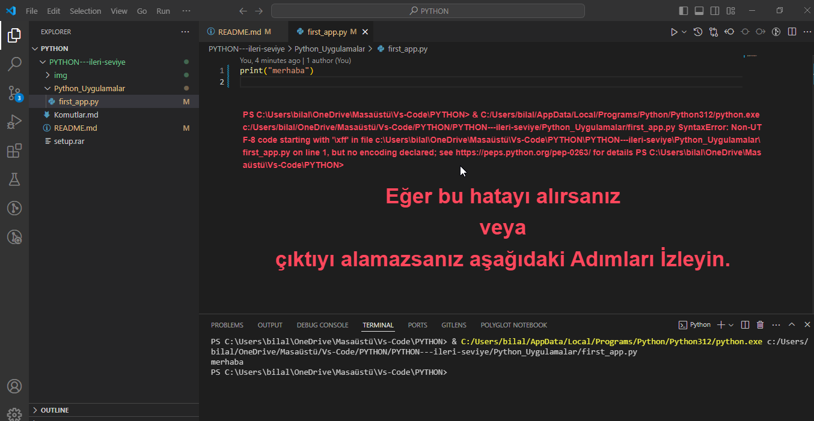
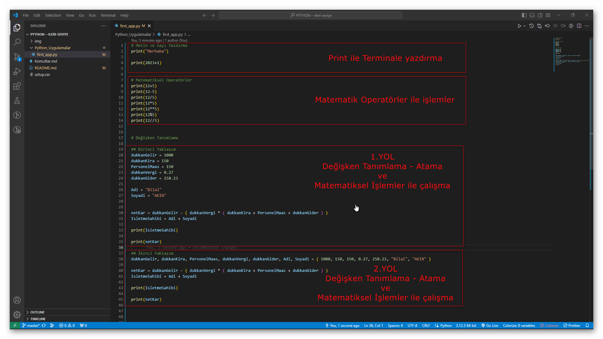
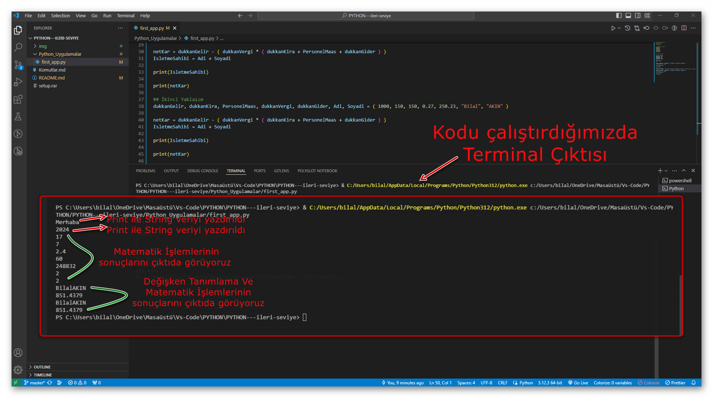

# PYTHON---ileri-seviye
PYTHON / İLERİ SEVİYE


## 1 - İLK KURULUM


## 2 - POWER SHELL - Kurulumu test Etme


## 3 - POWER SHELL - Versiyonlar arasında Geçiş ve Yorumlayıcı Test Etme


## 4 - VS CODE - Editör Seçme ve Eklentiyi Kurmak


## 5 - VS CODE - Terminalde Çalışmak.


**Python ile terminal komutları kullanırken sıkça karşılaşılan bazı komutlar:**
```python
ls      # İlgili Klasör içindeki tüm dosyaları listeler.
dir      # İlgili Klasör içindeki tüm dosyaları listeler.
cd [Dosya Adı]       # ilgili dizindeki dosyaya geçiş yapar.
cd..        # Bir üst Klasöre geçiş yapar.
cls         # Ekranı Temizler (Sadece Windows için).
clear       # Ekranı Temizler.
mkdir [Dosya Adı]       # Klasör Oluşturmak için.
rmdir [Klasör Adı]       # Klasör Silmek için.
del [Dosya Adı]       # Dosya silmek için.
code .      # Konumlanmış Kod Editörünü açmak.


echo $null >> first_app.py      #Python dosyası Ouşturmak için
python [Dosya_Adi.py]       #Python Dosyalarını Çalıştırır.


python      # Python yorumlayıcısını başlatır.
pip      # Python paketlerini yönetir (kurma, kaldırma, güncelleme vb.).
python dosya_adı.py      # Python betik dosyasını çalıştırır.
virtualenv      # Sanal Python ortamları oluşturur.
activate (Windows) / source activate (Unix)      # Sanal ortamı etkinleştirir.
deactivate      # Sanal ortamı devre dışı bırakır.
pip freeze      # Kurulu Python paketlerini ve sürümlerini listeler.
pip install paket_adı      # Belirli bir Python paketini kurar.
pip uninstall paket_adı      # Belirli bir Python paketini kaldırır.
pip show paket_adı      # Belirli bir Python paketinin bilgilerini gösterir.
pip search anahtar_kelime      # Anahtar kelimeye göre Python paketlerini arar.
pip list      # Kurulu Python paketlerini listeler.
python -m venv myenv      # Yeni bir sanal ortam oluşturur (Python 3.3+).
python -V (veya --version)      # Yüklü Python sürümünü görüntüler.
python -m pip install --upgrade pip      # Pip'in en son sürümünü yükseltir.
python -m http.server [port]      # Basit bir HTTP sunucusu başlatır.
python -c "print('Hello, world!')"      # Bir Python ifadesini doğrudan terminalden çalıştırır.
exit() veya Ctrl+D      # Python yorumlayıcısını kapatır.

```

**Bu komutlar, Python geliştirme sürecinde sıkça kullanılır ve paket yönetimi, sanal ortamlar, betik dosyalarının çalıştırılması gibi çeşitli görevleri gerçekleştirmek için kullanılır.**

- Diğer Komutlar İçin [Tıklayın.](Komutlar.md)


## 6 - İLK UYGULAMA - fist_app.py  


Yazdırmakta hata yaşadıysanız:
-Masaüstü'ne bir Yeni Klasör Oluşturun
- Başlata Tıklayın
- Python 3.12 > IDLE (Python 3.12 64-bit) -> Burada sürümünüz farklı olabilir önemli değil.
- **IDLE Shell** açılacaktır.
- Ctrl + S tuşlarına basarak çalışmayı boş olarak masaüstündeki Yeni klasöre kaydedin.
- Yeni Klasöre Gelin ve Sağ Clik yapın Vs code ile açın .
- Kaydettiğiniz dosyayı sol taraftan tıklayarak açın.
- içindebir şeyler yazılı ise Hepsini silin.
- print("Merhaba") yazın.
- Ctrl + S Kaydet ve Çalıştırın.
  
## 7 - PYTHON - Objeler ve Veri Yapıları
  

```python
python      # Python yorumlayıcısını başlatır.
quit()      # Python yorumlayıcısını Kapatır.
# Tek Satır           # Tek yorum satırı.
""" Çok Yorum Satırı """   # Çoklu yorum satırı.

type([Veri])        #Değerin Veri tipini verir

```

### Numbers: Insteger & Float & String & Bool 
*(Tam Sayılar & Ondalık Sayılar & Metinsel İfadeler & Boolean ifadeler)*

|Integer        |Floating Point | String        | Bool          |
| ------------- | ------------- | ------------- | ------------- |
| 5             | 5.2           | Beş           | True          |
| 25            | 2.333         | İki virgül üç | True          |
| -23           | 0.0           | Sıfır         | False         |


### Numbers: Math Operators 
*(Matematik Operatörleri)*

|Symbol         |Name           |
| ------------- | ------------- |
| +             | Toplama       |
| -             | Çıkarma       |
| /             | Bölme         |
| *             | Çarpma        |
| **            | Üs            |
| %             | Mod           |
| //            | Tam Bölme     |

### Numbers: Logic Operators 
*(Mantıksal Operatörleri)*

|Symbol         |Name           |
| ------------- | ------------- |
| =             | Atama         |
| +=            | Artırma       |
| -=            | Azaltma       |
| /             | Bölme         |
| *             | Çarpma        |
| **            | Üs            |
| %             | Mod           |
| //            | Tam Bölme     |



### Değişken Tanımlama - Atama İşlemleri

- Değişken tanımlarken, Rakam ile başlayamaz
- Büyük - Küçük harf Duyarlılığı vardır. User ile user farklı değişkenlerdir.
- Türkçe karekterler Kullanılmamalıdır.
- İki değişkenin Veri türü String ise ve Toplama operatörü kullanılırsa Toplamaz Birleştirir.
- İki değişken Arasında Boşluk Olamaz.





### Değişken Tanımlama - Veri Dönüşüm Tipleri

```python
x = 12       # Bu veri int değerindedir.
y = "12"     # Bu veri str değerindedir.
z = True    # Bu veri bool değerindedir.


print(type( x ))      # Burada x değerinin tipini sorguladığımızda <class 'int'> sonucunu vericektir.
print(type( y ))      # Burada y değerinin tipini sorguladığımızda <class 'str'> sonucunu vericektir.
print(type( z ))      # Burada z değerinin tipini sorguladığımızda <class 'bool'> sonucunu vericektir.

print( x )            # Burada x değerinin çıktısını **12** olarak vericektir.
print( y )            # Burada x değerinin çıktısını **"12"** olarak vericektir.
print( z )            # Burada x değerinin çıktısını **True** olarak vericektir.
```

**Veri tiplerini dönüştürelim**

- "int" veri tipindeki bir veriyi "str" veri tipine dönüştürmek istersem:

```python
x = 12

x = str ( x )


print(type( x ))      # Burada x değerinin tipini sorguladığımızda <class 'str'> sonucunu vericektir.
print( x )            # Burada x değerinin çıktısını **"12"** olarak vericektir.
```

- "str" veri tipindeki bir veriyi "int" veri tipine dönüştürmek istersem:

```python
y = "12"
y = int ( y )

print(type( y ))      # Burada y değerinin tipini sorguladığımızda <class 'int'> sonucunu vericektir.
print( y )            # Burada y değerinin çıktısını **12** olarak vericektir.
```


- "bool" veri tipindeki bir veriyi "int" veri tipine dönüştürmek istersem; True için 1 , False için 0 değerini alıcaktır. 

```python
z = True

print( z )            # Burada z değerinin çıktısı **True** olucaktır

z = int ( z )

print( type( z ) )      # Burada z değerinin tipini sorguladığımızda <class 'int'> sonucunu vericektir.
print( z )            # Burada z değerinin çıktısı **1** olucaktır
```
```python
z = False

print( z )            # Burada z değerinin çıktısı **False** olucaktır

z = int ( z )

print( type( z ) )      # Burada z değerinin tipini sorguladığımızda <class 'int'> sonucunu vericektir.
print( z )            # Burada z değerinin çıktısı **0** olucaktır
```


### PYTHON / input() - Kullanıcıdan Bilgi alma ve hesaplama

- Örnek : Yarı çapı verilen bir dairenin Alan ve Çevre hesaplamalarını yapalım.

```python

'''

Dairenin Alanı      :   πr²
Dairenin çevresi    :   2πr

'''

pi = 3.14

r = float(input("Dairenin yarı Çapını girin : "))


alan    = pi * ( r ** 2)  # πr²

print(type(alan))

cevre   = 2 * pi * r     # 2πr

print(type(cevre))


print("Alan : " + str(alan))
print("Çevre : " + str(cevre))

```


### PYTHON / len() & [] - Karekter Dizileri 

```python

Name = 'Bilal'
Surname = 'AKIN'
Age = 29

print( "My name is " + Name + " " + Surname + " and  \nI am " + str(Age) + " years old." )


```

- Verinin karekterleri ile çalışma **Veri[]**
```python
Name = 'Bilal'

print(Name[1])
print(Name[3])
print(Name[5])

```

- Verinin karekter Sayısını Hesaplama **len(Veri)**

```python

Name = 'Bilal'

print(len(Name))

```

- Verinin Son Karekterini yazdırma **len(Veri)-1**

```python

Name = 'Bilal'

# 1.yol

print(Name[len(Name)-1])

# 2.yol

print(Name[-1])

```

- İki index arsındaki veriyi yazdırma **Veri[Baslangıç(X):Bitiş(Y)]**

```python

Name = 'Bilal'

print(Name[1:3])

```

- Belirlenen indexten sonrasını yazdırma **Veri[X:]**

```python

Name = 'Bilal'

print(Name[1:])

```

- Belirlenen indexten Öncesini yazdırma **Veri[:Y]**

```python

Name = 'Bilal'

print(Name[:3])

```

- İki index arasındaki karekterlerin birini alıp birini almaması **Veri[X:Y:Kaçarkaçaralsın(Z)]**

```python

Name = 'Bilal AKIN'

print(Name[1:10:2])

```

### PYTHON / {} format() - String Formatlama 

```python

Name = 'Bilal'
Surname = 'AKIN'

print('My name is {} {}'.format(Name, Surname))

```